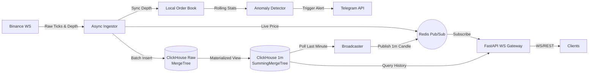

# Binance Market Data Ingestor & Analyzer


A high-throughput, fully asynchronous data pipeline designed to ingest, aggregate, and distribute real-time cryptocurrency market data from the Binance WebSocket API. 

This system is built to handle high-frequency trading data, utilizing **ClickHouse** for blazing-fast OLAP storage and on-the-fly aggregations, **Redis Pub/Sub** for decoupled real-time streaming, and **FastAPI** to serve both REST and WebSocket clients. It also features an advanced **Anomaly Detection Engine** that monitors L2 Order Book imbalances using rolling statistical models.

## ✨ System Highlights

*   **High-Frequency Ingestion:** Fully asynchronous WebSocket client (`aiohttp`) that buffers and batch-inserts raw L1 tick data into ClickHouse.
*   **Zero-Latency Aggregations (OLAP):** Leverages ClickHouse `Materialized Views` and `SummingMergeTree` engines to automatically aggregate raw tick data into 1-minute OHLCV-style candles directly at the database level.
*   **L2 Order Book Synchronization:** Maintains a real-time, synchronized local order book using Binance's `@depth@100ms` streams and REST API snapshots.
*   **Statistical Anomaly Detection:** Calculates continuous rolling standard deviations (Z-scores) of Bid/Ask volume imbalances (within a 5% price depth). Triggers real-time Telegram alerts when market manipulation or sudden liquidity shifts occur.
*   **Real-Time Streaming API:** Background workers broadcast completed 1-minute candles and live price ticks via Redis Pub/Sub to a FastAPI WebSocket gateway for low-latency client consumption.
*   **Modern Python Tooling:** Built with Python 3.12, strict type hinting (`Pydantic`), structured JSON logging (`structlog`), and managed via the lightning-fast `uv` package manager.

## 🏗️ Architecture



## 🚀 Getting Started

### Prerequisites
*   Docker & Docker Compose
*   *(Optional)* Telegram Bot Token and Chat ID (for anomaly alerts)

### 1. Configuration

Create a `.env` file in the root directory (only required if you want Telegram alerts):

```env
TG_BOT_TOKEN="your_telegram_bot_token"
TG_CHAT_ID="your_telegram_chat_id"
ANOMALY_SIGMA_THRESHOLD=3.0
DEPTH_PERCENT=0.05
TG_COOLDOWN_SEC=60
```

### 2. Launch the Stack

The entire infrastructure (ClickHouse, Redis, FastAPI Gateway, and Background Workers) is containerized. Start it with a single command:

```bash
docker-compose up -d --build
```

*Note: The ClickHouse database schemas, TTL policies (3 days), and Materialized Views are automatically initialized on the first boot via `sql/init.sql`.*

### 3. Verify Services

Check the logs to ensure the ingestor has connected to Binance and the order book is synced:
```bash
docker-compose logs -f ingestor
```

## 📖 API Documentation

Once running, interactive OpenAPI (Swagger) documentation is available at: `http://localhost:8000/docs`

### REST API

*   **`GET /api/v1/history/{symbol}`**
    *   Retrieves historical 1-minute aggregated candles directly from ClickHouse.
    *   *Parameters:* `symbol` (e.g., `btcusdt`), `limit` (default 60).

### WebSocket API

*   **Live Ticker Stream:** `ws://localhost:8000/api/v1/ws/{symbol}`
    *   Streams real-time raw price updates via Redis Pub/Sub.
*   **1-Minute Candle Stream:** `ws://localhost:8000/api/v1/ws/{symbol}/1m_candle`
    *   Pushes a summary event exactly once per minute containing the aggregated data for the previous minute.

## 🧠 Core Engineering Decisions

*   **Why ClickHouse?** Time-series market data requires massive insert throughput and fast analytical queries. ClickHouse's `MergeTree` handles millions of inserts/sec, and `Materialized Views` eliminate the need for a separate heavy aggregation service (like Apache Flink or Spark).
*   **Why local Order Book?** Relying purely on REST for depth data is too slow for anomaly detection. By maintaining a local copy updated via WS deltas (`lastUpdateId` tracking), the system can calculate volume imbalances in microseconds.
*   **Why Redis Pub/Sub?** It acts as a lightweight, lightning-fast message broker that decouples the data producers (Ingestor/Broadcaster) from the data consumers (FastAPI WebSocket clients), allowing the API to scale horizontally without bottlenecks.